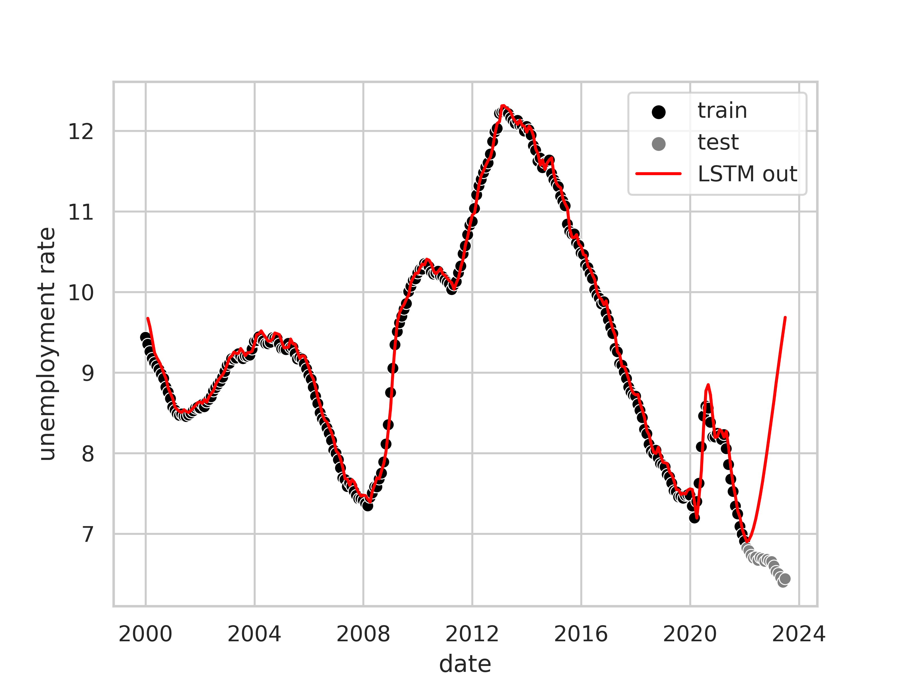

# Predicting unemployment in the euro zone

This project tries to predict the unemployment rate in the euro
zone based on macroeconomic data issued by ECB.

The main motivation for this project is to familiarize ourselves with machine learning on time series data.

## Data sources

The source for our data sets is the [ECB's statistics portal](https://sdw.ecb.europa.eu/), exclusively.

We use a variety of macroeconomic metrics such as the unemployment data, the GDP (at market price), or the population.

<p float="middle">


</p>

## ML approaches applied to unemployment rate

### Using a Gaussian process

We do not expect much from "predicting" the unemployment rate using a simple Gaussian process approach based on historical unemployment rate data.
After all, other than a general feeling for the variance of the unemployment rate, 
there is not much to learn for the model.
We do it anyway in order to familiarize ourselves with Gaussian processes, 
and we might need it in the future to _interpolate_ data where there is a lack of it.

As expected, while a Gaussian process with a Matérn kernel ($`\nu = \frac 12`$) fits the data quite well where it has data,
it completely fails to predict anything about the future:


Interpolation works okay-ish if the gaps are not too wide:


_See [unemployment_gp_trainer.py](src/eu_unemployment_prediction/simple_gp/unemployment_gp_trainer.py) for the code._

### Using an LSTM

#### Only learning based on recent unemployment rate

Given a time series of the unemployment rate the LSTM is trained to predict the next unemployment rate.
In a first step we only train it with recent unemployment rates and will look into pouring more macroeconomic data into the model in later stages.
We do not expect good predictions but the LSTM should be able to learn some form of correlation lengths similar to the gaussian process above.

The following figure shows the output of the LSTM model trained on the whole time series. 



## Contributing

The repo uses black and mypy among other things.
Make sure 

### Setup

Install dev dependencies:

```shell
pip install .[dev]
```

