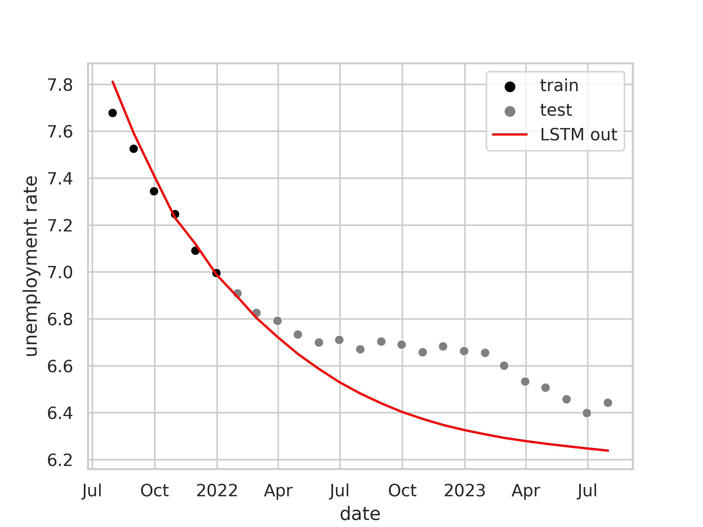
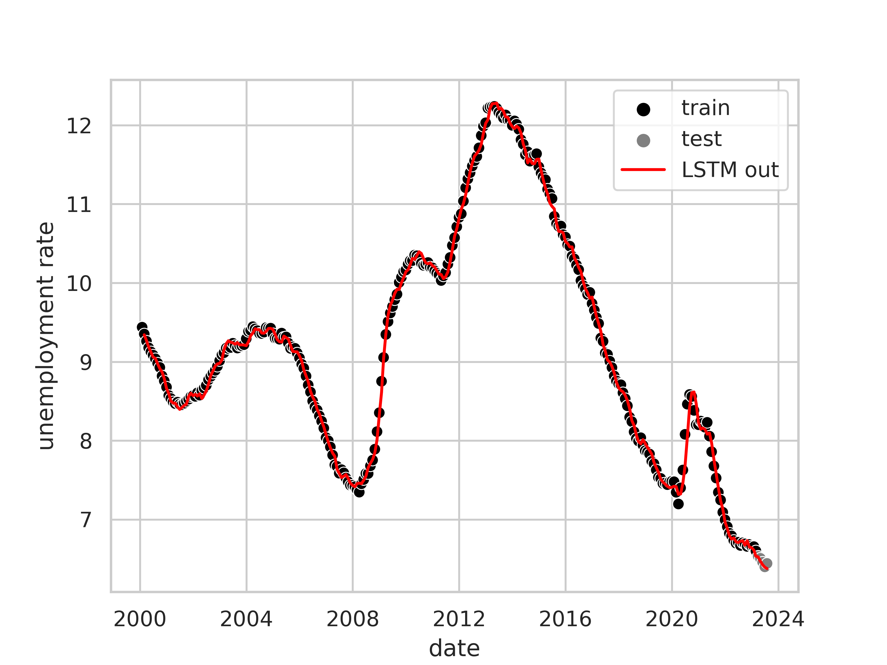
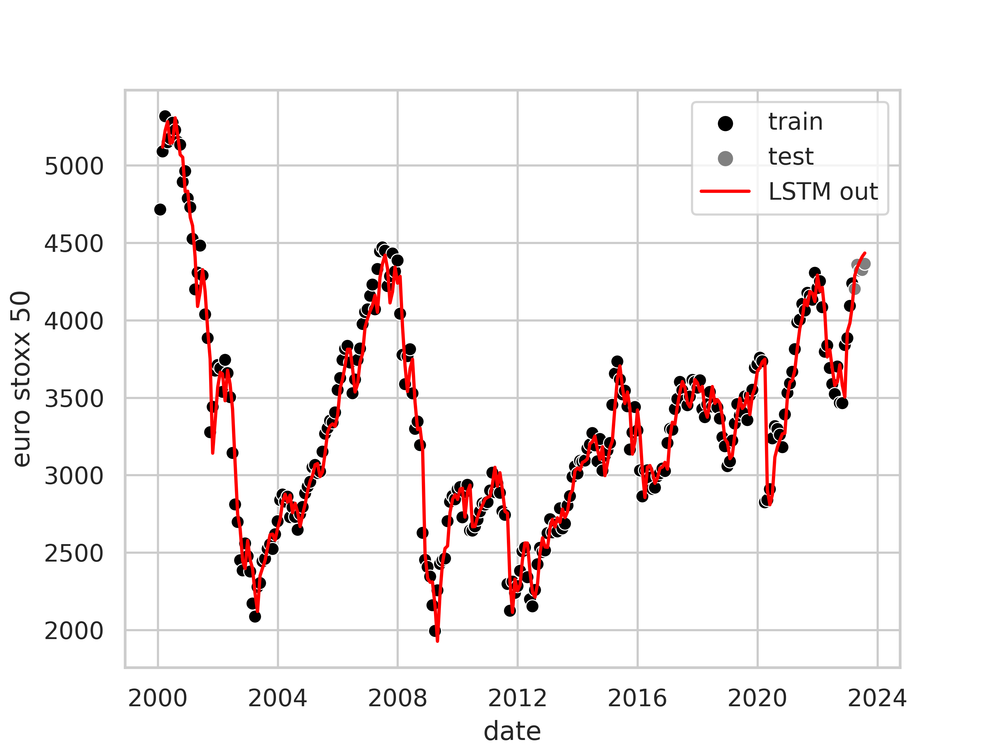
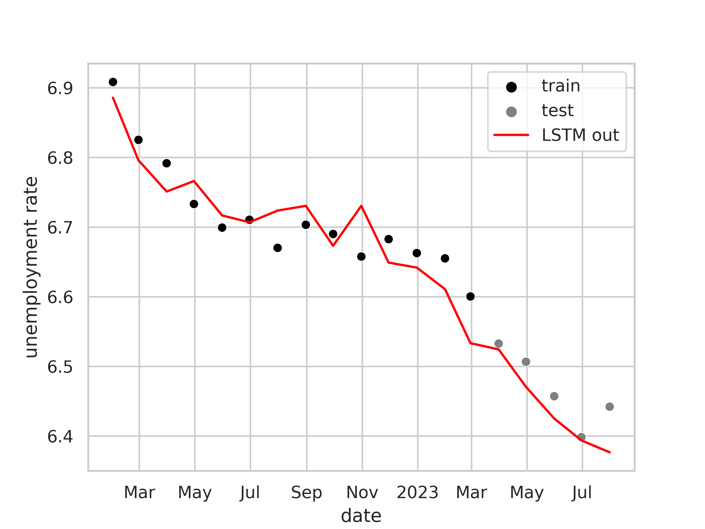
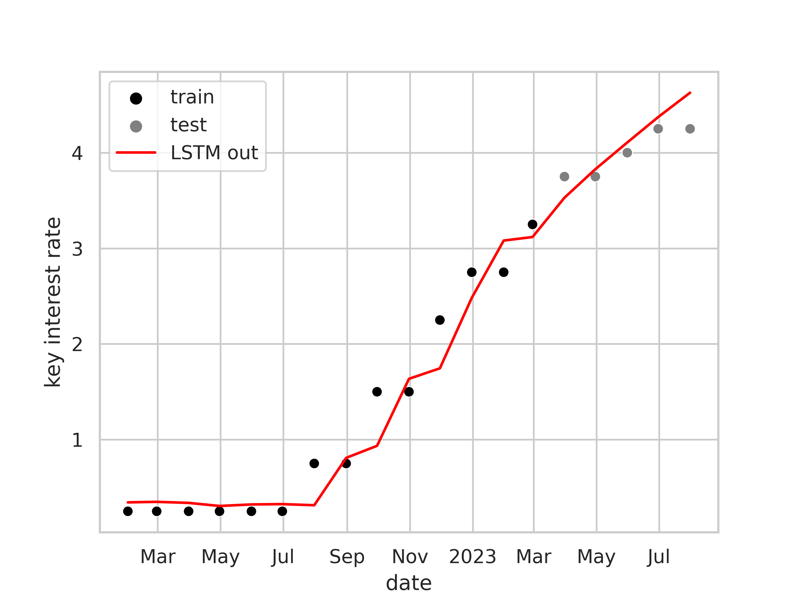
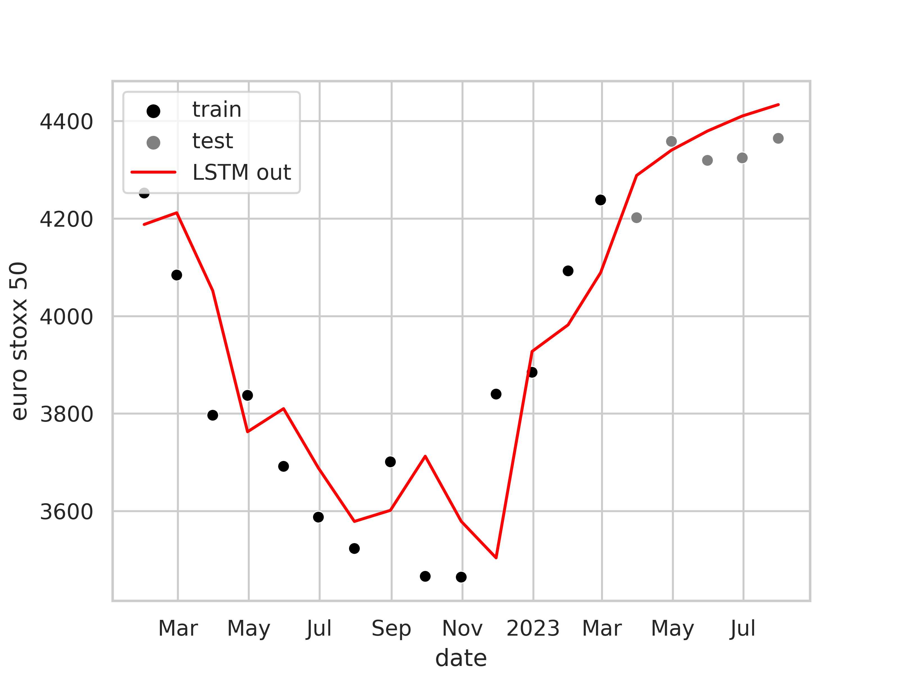

# Predicting unemployment in the euro zone

This project tries to predict the unemployment rate in the euro
zone based on macroeconomic data issued by ECB.

The main motivation for this project is to familiarize ourselves with machine learning on time series data.

Jump to [Latest results](#latest)

## Data sources

The source for our data sets is the [ECB's statistics portal](https://sdw.ecb.europa.eu/), exclusively.

We use a variety of macroeconomic metrics such as the unemployment data, the GDP (at market price), or the population.

<p float="middle">


</p>

## ML approaches applied to unemployment rate

### Using a Gaussian process

We do not expect much from "predicting" the unemployment rate using a simple Gaussian process approach based on historical unemployment rate data.
After all, other than a general feeling for the variance of the unemployment rate, 
there is not much to learn for the model.
We do it anyway in order to familiarize ourselves with Gaussian processes, 
and we might need it in the future to _interpolate_ data where there is a lack of it.

As expected, while a Gaussian process with a Matérn kernel ($`\nu = \frac 12`$) fits the data quite well where it has data,
it completely fails to predict anything about the future:


Interpolation works okay-ish if the gaps are not too wide:


_See [unemployment_gp_trainer.py](src/eu_unemployment_prediction/simple_gp/unemployment_gp_trainer.py) for the code._

### Using an LSTM

#### Only learning based on recent unemployment rate

([Source](scripts/lstm_u.py))

Given a time series of the unemployment rate the LSTM is trained to predict the next unemployment rate.
In a first step we only train it with recent unemployment rates and will look into pouring more macroeconomic data into the model in later stages.
We do not expect good predictions but the LSTM should be able to learn some form of correlation lengths similar to the gaussian process above.

The following figure shows the output of the LSTM model (hidden state dimension: 32) trained on the time series up to 2022-01-01. 


The model is very good at fitting the data it was trained on.
Predictions about the "future" after 2022-01-01 are not bad but may be subject to a favourable cut-off point for test/training data.
It is safe to say, that some sort of correlation length was learned and is used in the regime
where the model has not been trained on.




<a name="latest"></a>
#### Learning unemployment, key interest rate and eurostoxx 50 together

([Source](scripts/lstm_uek.py))

As a next step we use the same LSTM model with on a higher-dimensional dataset.
Apart from the unemployment rate we include the timestamps, ECB's key interest rate, and the Euro Stoxx 50 index.
On a technical level, the LSTM model tries to predict a 4-dimensional vector at time $`t+1`$ given a 4-dimensional vector at time $`t`$.
Each dimension represents one of the before mentioned features.
The time-step distance is set to one month. 
Since some of the underlying datasets like the one for the key interest rate are not provided monthly, but somewhat randomly, each feature may be
interpolated in one or the other way in order to provide a monthly value.
For example, for the key interest rate, we interpolate piece-wise constant, for a feature like GDP a cubic-spline interpolation would be used.

##### Results

While the LSTM model does fit the training data quite well, its predictions about the future are questionable.

The following figures present the LSTM's predictions on the different features for both, train and test regions.

<p float="middle">



</p>

Looking a little bit more closely at the regime where the model did not have training data, we see good predictions for the ECB's key interest and the Euro Stoxx 50 index
but rather bad or exaggerated predictions for the unemployment rate.

<p float="middle">



</p>

These results are rather flaky.
The LSTM will predict very different things if we start the test-range a little earlier or if we stop the training at a different point (with marginal differences in the overall loss).
This may indicate that there is little covariance between unemployment rate, Euro Stoxx 50, and the key interest rate.

## Contributing

The repo uses black and mypy among other things.
Make sure 

### Setup

Install dev dependencies:

```shell
pip install .[dev]
```
